# Processing Mini Projects

This is a collection of tiny experiments I did with processing over the years

### [2DSpline](2DSpline)
a canvas to place points that get connected with splines
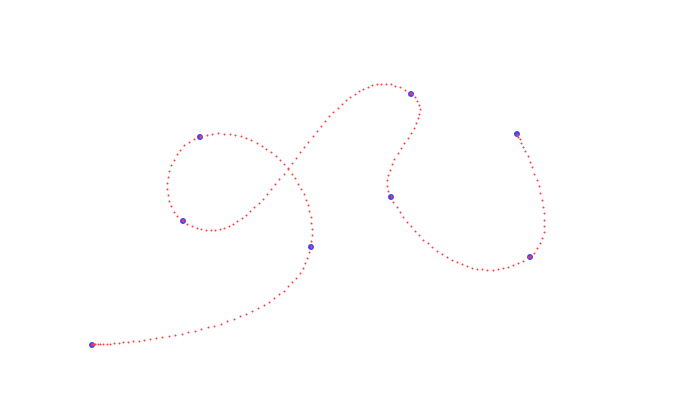

### [BlockAnimation](BlockAnimation)
an animation like falling minecraft sand
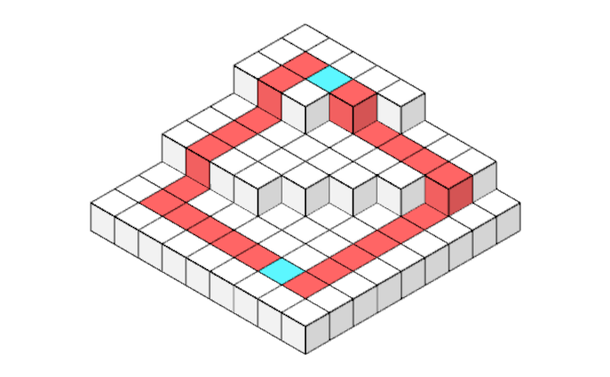

### [BlockCoordinates](BlockCoordinates)
small tool that helped me figure out how to rotate Minecraft block coordinates
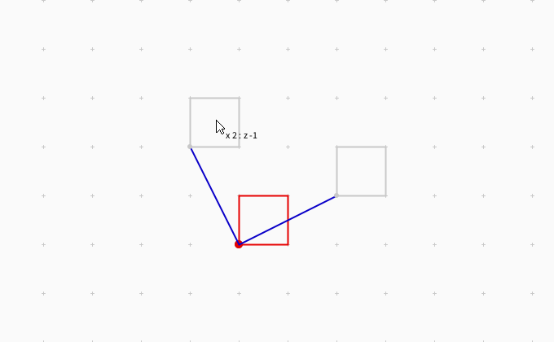

### [BrownianNoise](BrownianNoise)
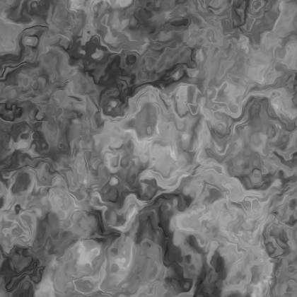

### [Chalkboard](Chalkboard)
a chalk line renderer that actually looked really nice imo

### [CharacterAnimation](CharacterAnimation)
a tiny editor that helped me create body part transformations for a raytracer animation
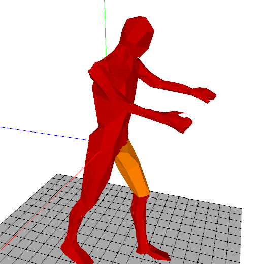

### [ChromaticAbberation](ChromaticAbberation)
Woooooo ooooow  
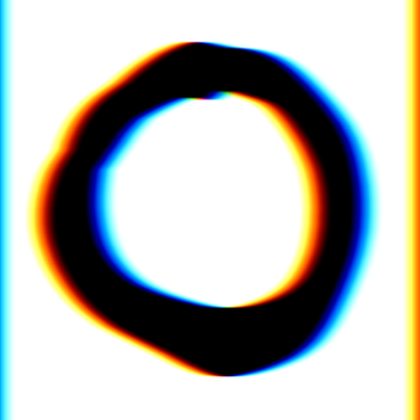

### [ColorPalette](ColorPalette)
small attempt to make an editor to put color palettes together  
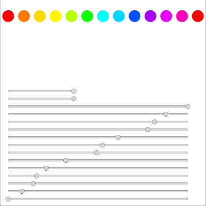

### [ConvexHull](ConvexHull)
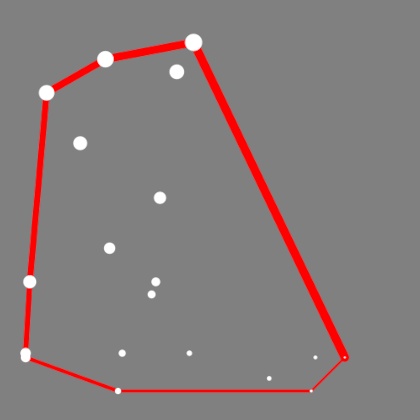

### [DndDice](DndDice)
geometry i needed as drawing reference. could have used blender  
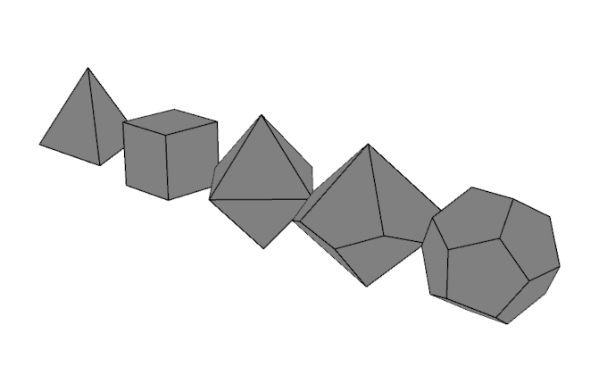

### [FortunesAlgorithm](FortunesAlgorithm)
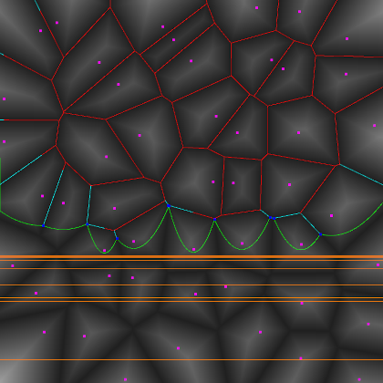

### [FibonacciDisk](FibonacciDisk)
the sunflower pattern  
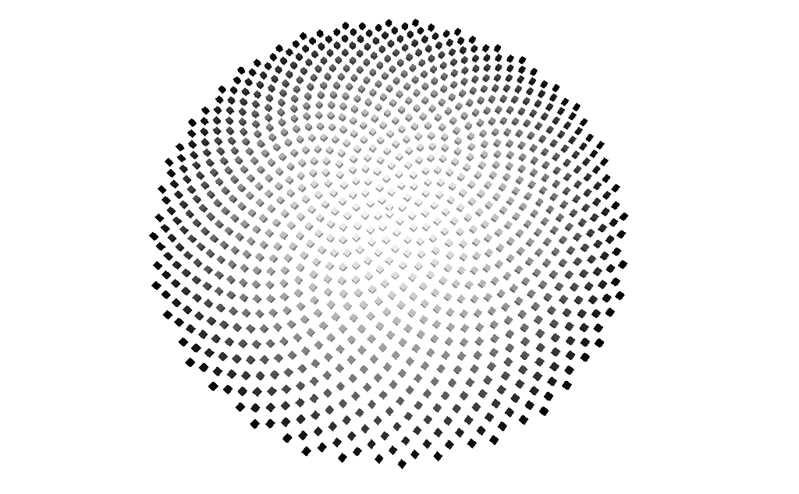

### [HilbertCurve](HilbertCurve)
remake of a t-shirt design I saw online  
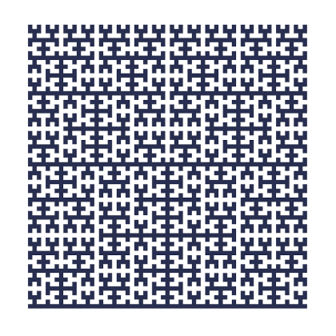

### [HilbertSlime](HilbertSlime)
a squishy hilbert curve (animated)  

### [ImageToColorblindTest](ImageToColorblindTest)
converts images to these color blind test bubbles  
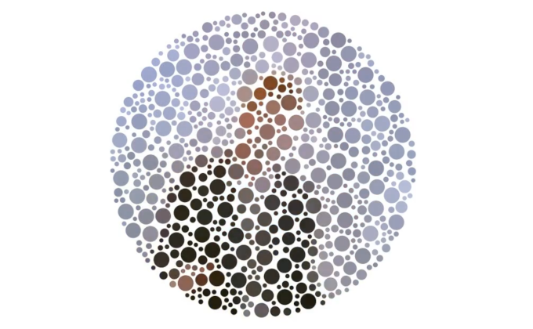

### [MazeAlgorithmVisualization](MazeAlgorithmVisualization)
an animation of different maze generation algorithms  
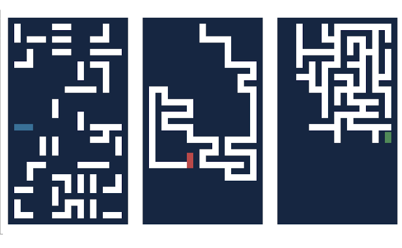

### [OrigamiSim](OrigamiSim)
an attempt to make a 2D paper folding simulator. it worked... sometimes  
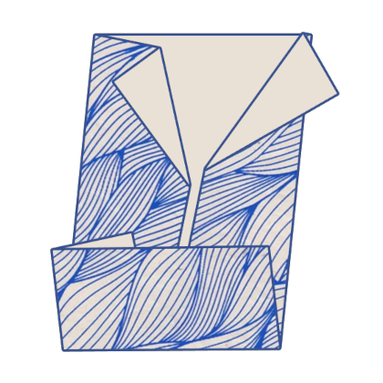

### [PortalSimulation](PortalSimulation)
a tiny voxel area I used to figure out some properties about view cones through a blocky window  
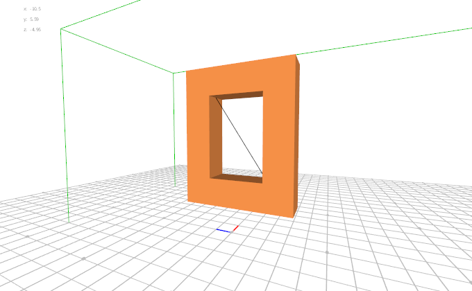

### [RadialNoise](RadialNoise)
perlin noise... in a circle  
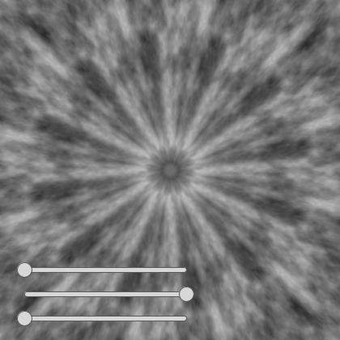

### [RainbowBlob](RainbowBlob)
an animated wobbly blob i tried to recreate from https://www.uni-weimar.de/bauhausmodule/  
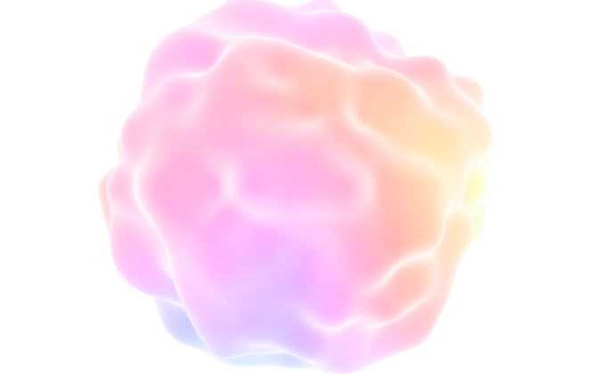

### [RainbowSmoke](RainbowSmoke)
after the concept of [Jozsef Fejes](http://rainbowsmoke.hu/home)  
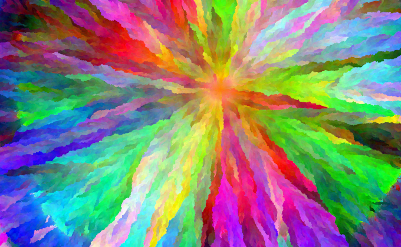

### [RingPattern](RingPattern)
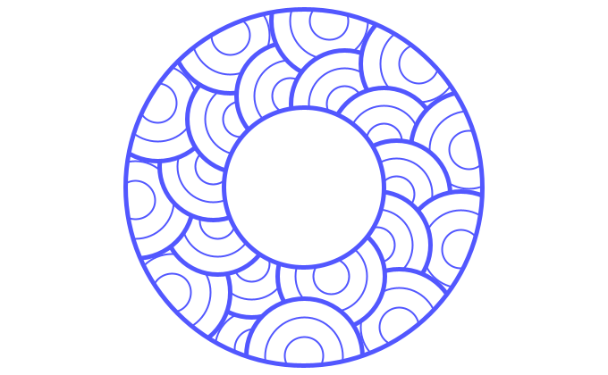

### [RingPattern2](RingPattern2)
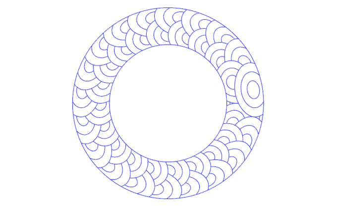

### [SixStarMandala](SixStarMandala)
a canvas to draw things mirrored along 12 axes  
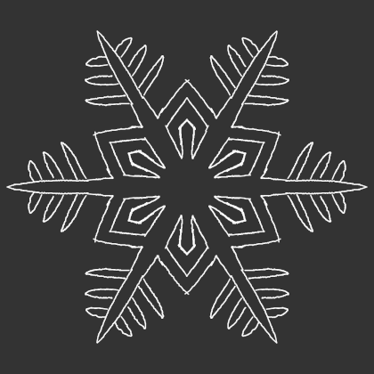

### [SphereRandom](SphereRandom)
random points distributed nicely smooth even over a sphere  
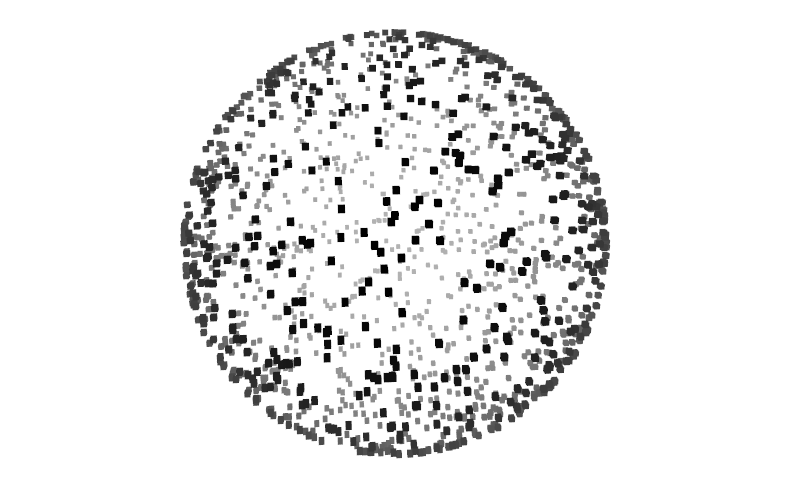

### [Spikeball](Spikeball)
an assortment of tubes with variable thickness to make all kinds of silly shapes  
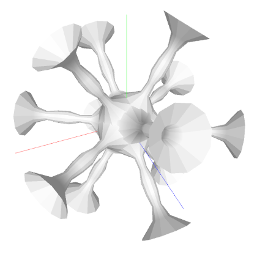